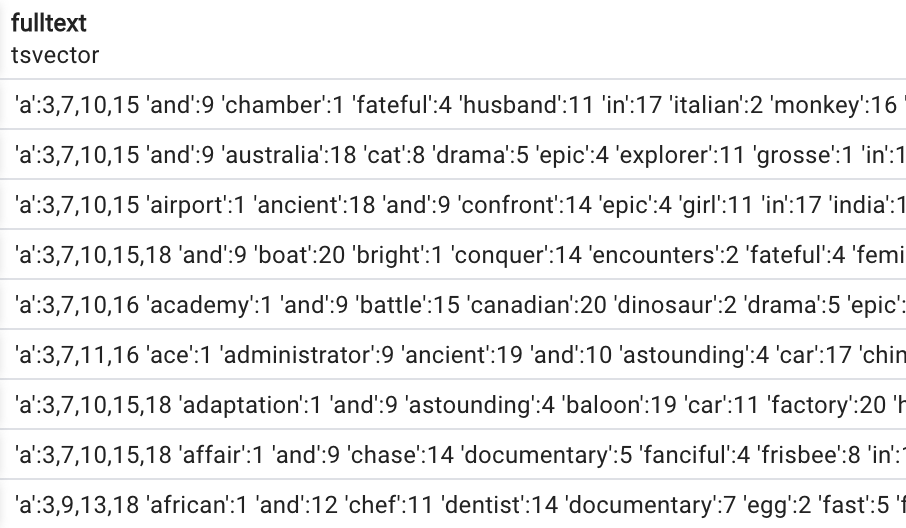
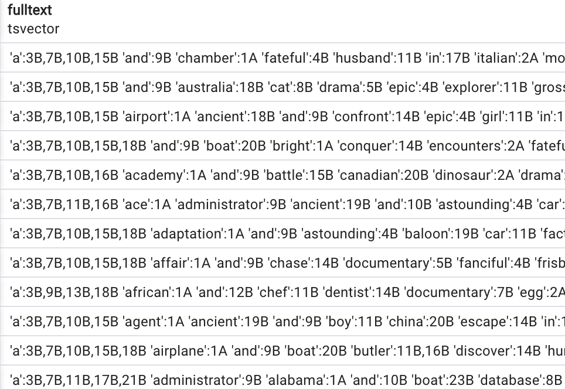
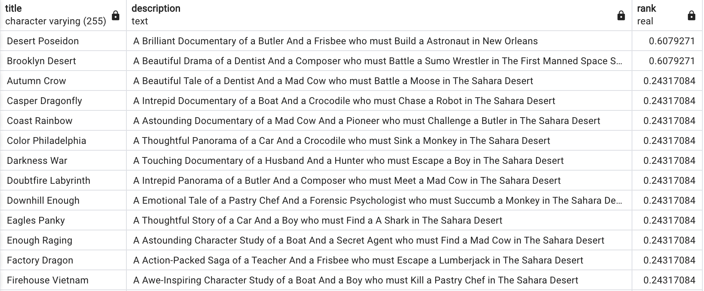
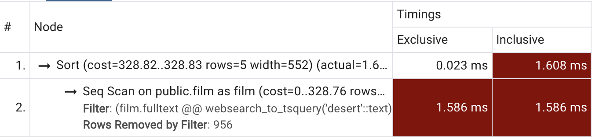
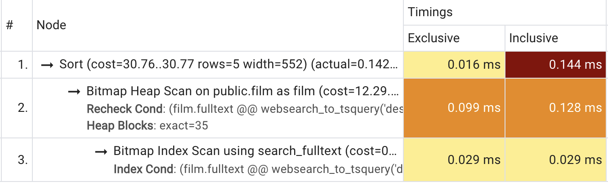

In [Part 1](/posts/psql-full-text-search/) of this tutorial about full text search using PostgreSQL, we talked about using functions such as `to_tsquery` and `websearch_to_tsquery`, which builds upon PostgreSQL ability to decompose longer sentences to smaller chunks called *lexemes* using `tsquery`.

Now we're going to expand our knowledge and implement multi-column full text search and add indexes for a more performant search. In this next step we want to search film titles AND film descriptions using our `dvdrental` database. In the stock database multi-column indexed search is already implemented but we're going to scrap that for the sake of this tutorial:

```SQL
drop index idx_fulltext;
```

```SQL
alter table film drop column fulltext;
```

## Creating a combined tsvector column
Doing a full text search through multiple columns is easy as combining the `to_tsvector` results of wanted columns into one concatenated result:

```SQL
select to_tsvector(title) || ' ' ||  to_tsvector(description) as fulltext 
from film;
```


<p align="center">
  
</p>
<p style="text-align: center;">1000 rows</p>


But in this approach each column has the same 'importance' in our search. To optimize this we want to add more importance to our `title` column in front of the `description`. Fortunately, Postgres has this covered with the `setweight` function! This functions accepts two parameters, a `tsvector` value and a letter from A to D which determines the importance, or weight, of the column. Combining all this we get the following query:

```SQL
select setweight(to_tsvector(title), 'A') || ' ' ||  setweight(to_tsvector(description), 'B') as fulltext
from film;
```


<p align="center">
  
</p>
<p style="text-align: center;">1000 rows</p>


We could add `websearch_to_tsquery` to the mix from the [Part 1](/posts/psql-full-text-search/) but the query would be too messy and hard to read. Instead, lets add a new column which is a calculated `tsvector` column from the combination of `title` and `description` and has a search weight added for prioritizing results. The best candidate are *generated columns*:
> A generated column is a special column that is always computed from other columns. Thus, it is for columns what a view is for tables. - PostgreSQL documentation

```SQL
alter table film 
add fulltext tsvector 
generated always as	(
	setweight(to_tsvector('simple', title), 'A') || ' ' ||  setweight(to_tsvector('simple', description), 'B') :: tsvector
) stored;
```

Note the added `simple` value in our `to_tsvector` function. We add this because PostgreSQL throws an exception if we explicitly don't define the 'regional configuration' or a dictionary which will be used for deriving lexemes. Other options are `english`, `spanish` etc. Read more about that in the official PostgreSQL documentation.

Now we can easily search through both of our columns, giving priority to the `title` column using `websearch_to_tsquery`:

```SQL
select title, ts_rank(fulltext, websearch_to_tsquery('desert')) as rank
from film
where fulltext @@ websearch_to_tsquery('desert')
order by rank desc;
```


<p align="center">
  
</p>
<p style="text-align: center;">44 rows</p>


## Indexes
When we do a `ANALYZE EXPLAIN` we can see that the PostgreSQL query profiler is not happy:


<p align="center">
  
</p>
<p style="text-align: center;">Profiler is not happy</p>


To optimize this query we can add an index to our `fulltext` column. The most optimized index for a `tsvector` data type is called `GIN` and the following query will create one:

```SQL
CREATE INDEX search_fulltext ON film USING GIN(fulltext);
```

Now when we check the profiler we can see the results are much much better:


<p align="center">
  
</p>
<p style="text-align: center;">Much better!</p>


We got from 1.609ms to 0.144ms, that's a huge performance improvement!

## What next?
In the next part we'll cover how to setup a REST API direct on top of our PostgreSQL db and do full text search on our data.