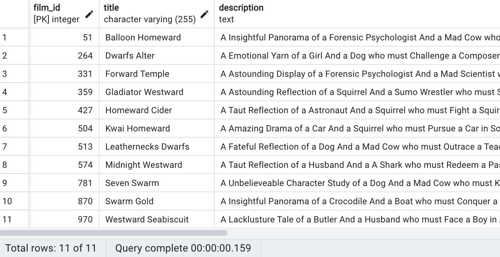

Let's say we are building an app for searching movies in our private collection. Our app, for simplicity, can only search movies using movie titles. In the following examples we'll show a few different approaches how to do a full text search using PostgreSQL.

In this tutorial we're going to use the sample database called "dvdrental" which can be found [here](https://www.postgresqltutorial.com/postgresql-getting-started/postgresql-sample-database/).

## Full Text Search using `LIKE` and `ILIKE` operators
Let's say we have a movie called "Darkness War" and we want to search it. The first, most easiest, and the least optimized way would be using the `LIKE` operator and wrapping individual words in `%` characters:

```SQL
select * from film where title like '%darkness%' or title like '%war%'
```

The result:

