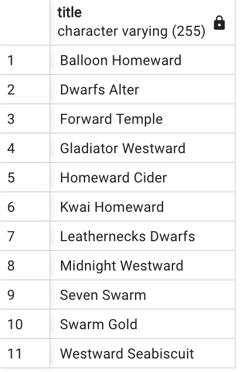
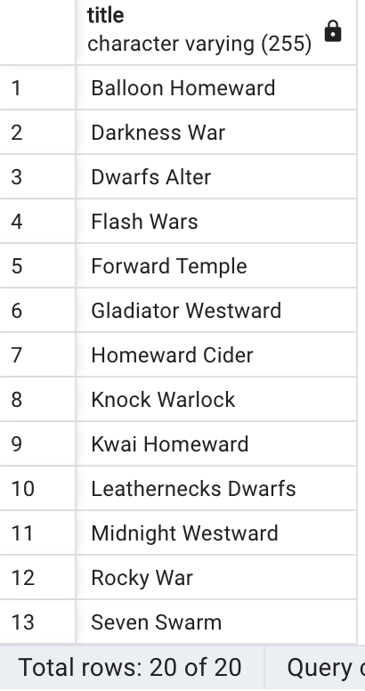
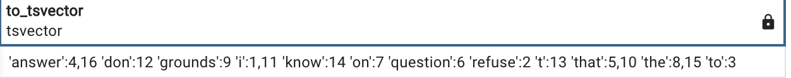
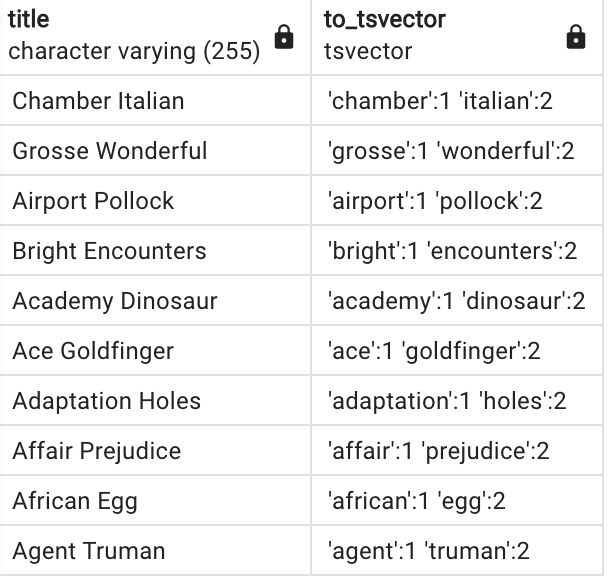
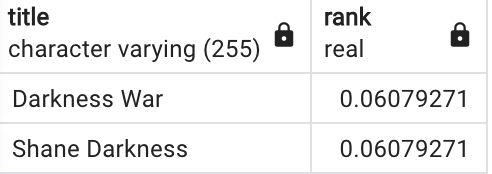
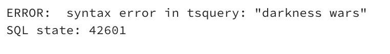
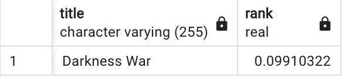
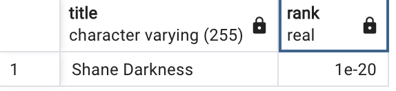

Let's say we are building an app for searching movies in our private collection. Our app, for simplicity, can only search movies using movie titles. In the following examples we'll show a few different approaches how to do a full text search using PostgreSQL.

In this tutorial we're going to use the sample database called "dvdrental" which can be found [here](https://www.postgresqltutorial.com/postgresql-getting-started/postgresql-sample-database/).

## Full Text Search using `LIKE` and `ILIKE` operators
Let's say we have a movie called "Darkness War" and we want to search it. The first, most easiest, and the least optimized way would be using the `LIKE` operator and wrapping individual words in `%` characters:

```SQL
select * from film where title like '%darkness%' or title like '%war%'
```
The result:

<p align="center">
  
</p>
<p style="text-align: center;">11 rows</p>


11 results, but we're missing our desired title - the reason is that `LIKE` is case sensitive. To fix that, let's use `ILIKE`:

```SQL
select * from film where title ilike '%darkness%' or title ilike '%war%'
```


<p align="center">
  
</p>
<p style="text-align: center;">20 rows</p>


Now we got our wanted result, but the list seems un-ordered and we miss a ranking system which of the results is a better match to our search query.

## Enter `tsvector`
So this is the star of the tutorial. PostgreSQL documentation states the following:
> A `tsvector` value is a sorted list of distinct lexemes, which are words that have been normalized to merge different variants of the same word.

We all heard about tokens in this AI language model age, and tokens in a sentence are simply words. Lexems are *normalized* tokens (words) of a sentence - this normalization may include converting all characters to lowercase, removing punctuation, and applying stemming (reducing words to their root form) to account for variations of the same word.

A `tsvector` is an ordered list of lexemes, along with their positions and weights. The weights indicate the importance of a particular lexeme concerning the relevance of a document in a search query. A `tsvector` is essentially an optimized, compressed representation of the lexemes present in a document, which allows for faster full-text searches.

Enough of theory, let's get our hands dirty!

We can use the `to_tsvector` function to parse text and turn into a tsvector for us:

```SQL
select to_tsvector('I refuse to answer that question on the grounds that I don''t know the answer.');
```

<p align="center">
  
</p>


We can also do this to our film titles:

```SQL
select title, to_tsvector(title) from film limit 10;
```


<p align="center">
  
</p>


To utilize `to_tsvector` in our full text search engine we're going to use two additional functions - `to_tsquery` and `ts_rank`.
`to_tsquery` helps us query plain text against a `tsvector` while `ts_rank` returns how well our query matches the result. Combining those two in a query we can get ranked results back:

```SQL
select title, ts_rank(to_tsvector(title), to_tsquery('darkness')) as rank
from film
where to_tsvector(title) @@ to_tsquery('darkness');
```


<p align="center">
  
</p>
<p style="text-align: center;">20 rows</p>


Let's try and expand our query and find "Darkness War":

```SQL
select title, ts_rank(to_tsvector(title), to_tsquery('darkness war')) as rank
from film
where to_tsvector(title) @@ to_tsquery('darkness war');
```

<p align="center">
  
</p>
<p style="text-align: center;">Syntax error</p>


Uh-oh! We're getting back a syntax error because `to_tsquery` only accepts single words without spaces or as the PostgreSQL documentation states:
>`to_tsquery` creates a `tsquery` value from querytext, which must consist of single tokens separated by the tsquery operators `&` (AND), `|` (OR), `!` (NOT), and `<->` (FOLLOWED BY), possibly grouped using parentheses.

In other words, we could search for "Darknes Wars" by formating our query like `to_tsquery('darkness<->wars')` but that would be cumbersome to do each time in the SQL query or messy doing it programatically inside our app.

The solution? `websearch_to_tsquery` function:

```SQL
select title, ts_rank(to_tsvector(title), websearch_to_tsquery('darkness war')) as rank
from film
where to_tsvector(title) @@ websearch_to_tsquery('darkness war');
```


<p align="center">
  
</p>
<p style="text-align: center;">1 result</p>


`websearch_to_tsquery` is a really powerful function and it's the function I personally like to use the most when using PostgreSQL as my full text search engine. It supports operators inside the query text:

- `"quoted text"`: text inside quote marks will be converted to terms separated by `<->` operators. Also, stop words are not simply discarded, but are accounted for.
- `OR`: the word “or” will be converted to the `|` operator.
- `+`: a plus will be converted to the `&` operator.
- `-`: a dash will be converted to the `!` operator.

This can be utilized greatly to expand your search engine. For example, let's search for movies that have a word "darkness" in it but do not have the word "war":

```SQL
select title, ts_rank(to_tsvector(title), websearch_to_tsquery('"darkness" -war')) as rank
from film
where to_tsvector(title) @@ websearch_to_tsquery('"darkness" -war');
```


<p align="center">
  
</p>
<p style="text-align: center;">1 result</p>


## What next?
In the upcoming Part 2 we'll cover indexes and full text search through multiple columns. After doing that, in Part 3 we're going to cover how to quickly create an REST api on top of our database using [PostgREST](https://postgrest.org/) and perform our full text search from a client app.