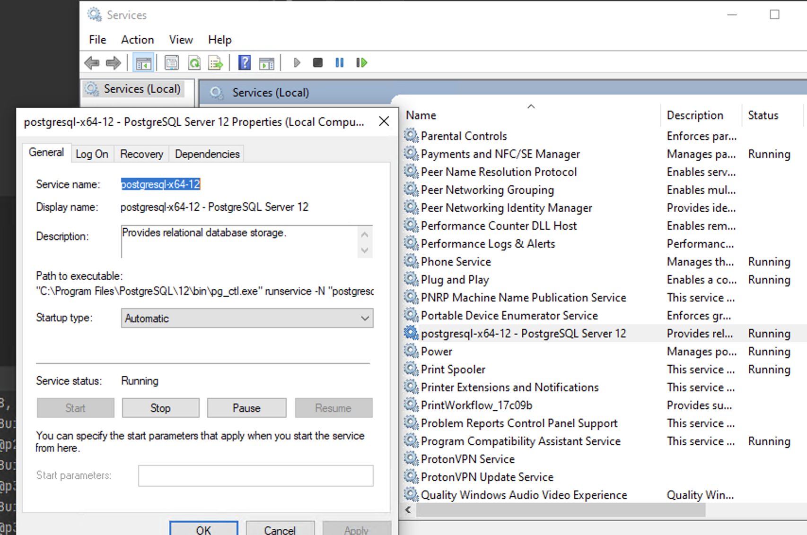

I'm running a PostgreSQL 12 instance as a Windows Service on one of my machines and one of the databases is getting too big (~72GB) for my `C:` drive. I have a great candidate for where to migrate my data - a nearly empty 1TB SSD attached to the machine. 

The machine in question is my old Lenovo Thinkpad P51 laptop which I run 24/7 with the lid closed. It has some juciy specs for its time such as 32GB RAM and 4GB GPU. I plan to install Linux on it and use it as my home server but for now I'm running stock Windows 10 + docker for some services I fiddle around.

## Locating the data folder and the name of the PostgreSQL service
To locate where our database data is stored a simple query is enough:
```SQL
SHOW data_directory;
```


<p align="center">
  
</p>
<p style="text-align: center;">Location of my data folder</p>


Next step would be to stop the PostgreSQL service. We can do that by running `services.msc` and finding our service in the list:


<p align="center">
  
</p>
<p style="text-align: center;">Note: postgresql-x64-12 is the "real" name of the service, not the "Display Name". You can see that in the properties of the service inside the services app.</p>


Stop the service and copy the `data` folder to the new location. In my case that's going to be `F:/psql`.

**Note:** By stopping the service we avoid having corrupt data in our new `data` folder. This step is highly important!

## Creating a new PostreSQL service
PostgreSQL installation comes with a handy app called `pg_ctl` which we can run in our command line. We're going to use it to register our new service and un-register (delete) our old one.

To register our new service we need to run the following command where you substitute `postgresql-x64-12-new-service` with your desired service name and `F:/psql:/data` with the new path of your migrated `data` folder:

```cmd
pg_ctl register -N postgresql-x64-12-new-service -D "F:/psql/data"
```

What I usually do next is test was my migration and creation of the new PostgreSQL service successful by renameing the old `data` folder to something like `data_old`. Then I start my new service, if it's not already started, and try to connect to my PosgreSQL server and query a database. If all went well this should work seamlessly.

## Deleting the old service
After testing that the migration went well we need to delete the old service by running the next command and including the name of the old service:
```cmd
pg_ctl unregister -N postgresql-x64-12
```

## Cleanup
After everything is done, I like to keep the `data_old` folder for a few days before deleting it. Call me paranoid but I like to have a backup plan if something goes wrong.